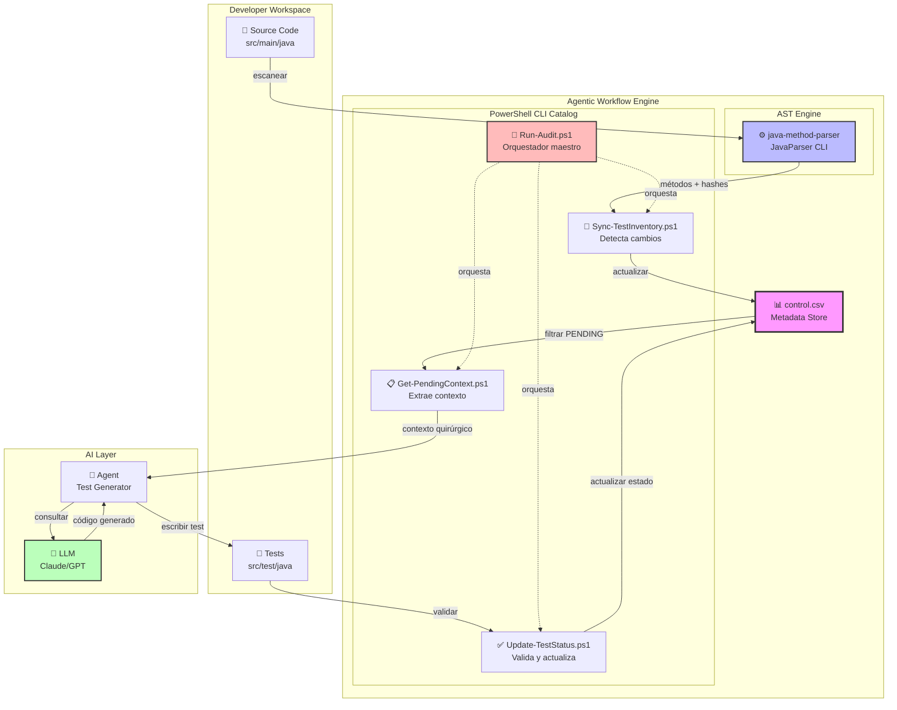
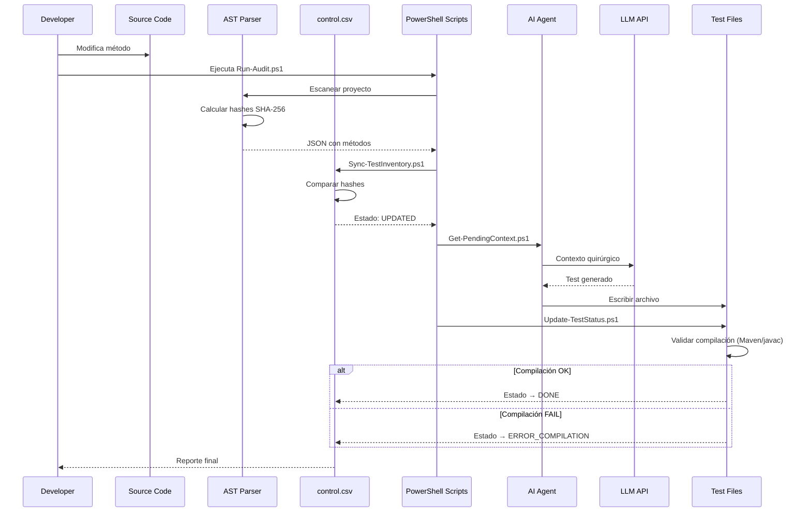
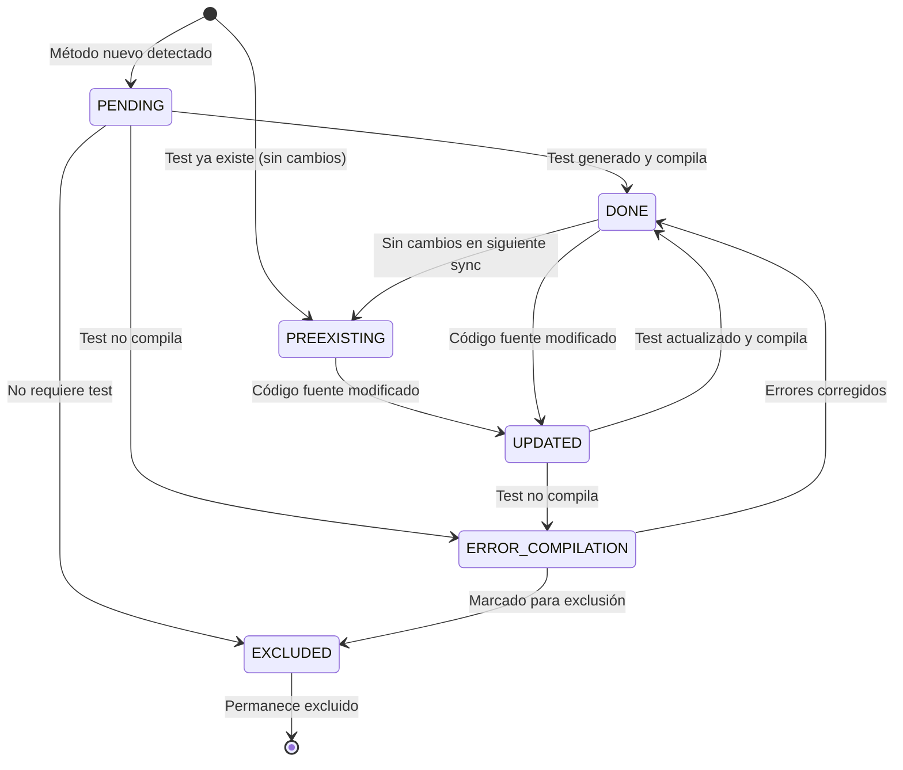

# Agentic Workflow for Unit Test Maintenance

> **Sistema Automatizado de Gestión de Tests Unitarios con Patrón de Flujo Agéntico**  
> Diseñado para entornos corporativos de alta seguridad con requisitos estrictos de compliance

---

## 📋 Tabla de Contenidos

- [Concepto](#-concepto)
- [Arquitectura](#-arquitectura)
- [Guía de Inicio Rápido](#-guía-de-inicio-rápido)
- [Catálogo de Scripts](#-catálogo-de-scripts)
- [Estados del Sistema](#-estados-del-sistema)
- [Gobernanza y Compliance](#-gobernanza-y-compliance)
- [Estructura del Proyecto](#-estructura-del-proyecto)
- [Requisitos](#-requisitos)
- [FAQ](#-faq)

---

## 🎯 Concepto

### El Patrón de Agentic Workflow

Este proyecto implementa un **patrón de flujo agéntico** que separa claramente dos capas de responsabilidad:

#### 1. **Capa Determinista (Local Skills)**
- **Responsabilidad**: Tareas pesadas, análisis de sistema de archivos, parseo AST, cálculo de hashes
- **Tecnología**: Scripts PowerShell + CLI Java (JavaParser)
- **Características**:
  - Ejecución 100% local
  - Resultados predecibles y reproducibles
  - Sin consumo de tokens LLM
  - Provee "ground truth" al sistema

#### 2. **Capa de Razonamiento (LLM)**
- **Responsabilidad**: Análisis de código, generación de tests, decisiones lógicas
- **Tecnología**: LLM (Claude, GPT, etc.)
- **Características**:
  - Consume solo el contexto necesario (quirúrgico)
  - Actúa únicamente cuando hay cambios detectados
  - Basado en lineamientos y mejores prácticas
  - Alta precisión y mínimo token consumption

### Ventajas del Patrón

```
┌─────────────────────────────────────────────────────────────┐
│                     FLUJO TRADICIONAL                       │
│  LLM → Leer 10 archivos → Decidir qué cambió → Generar     │
│  Costo: Alto | Precisión: Media | Velocidad: Lenta         │
└─────────────────────────────────────────────────────────────┘

┌─────────────────────────────────────────────────────────────┐
│                    AGENTIC WORKFLOW                         │
│  Script → Detectar 1 cambio → LLM genera solo ese test     │
│  Costo: Bajo | Precisión: Alta | Velocidad: Rápida         │
└─────────────────────────────────────────────────────────────┘
```

**Beneficios Cuantificables**:
- ✅ **Reducción de tokens**: 90% menos consumo de LLM
- ✅ **Precisión**: Detección exacta de cambios (hash-based)
- ✅ **Velocidad**: Procesamiento paralelo posible
- ✅ **Auditabilidad**: CSV con trazabilidad completa

---

## 🏗️ Arquitectura

### Diagrama de Componentes



### Flujo de Datos



---

## 🚀 Guía de Inicio Rápido

### Prerequisitos

```powershell
# Verificar Java 11+
java -version

# Verificar Maven
mvn -version

# Verificar PowerShell 5.1+
$PSVersionTable.PSVersion
```

### Instalación

```powershell
# 1. Clonar repositorio
git clone https://github.com/your-org/axet-plugin-unit-test.git
cd axet-plugin-unit-test

# 2. Compilar el parser Java
cd tools/java-parser
mvn clean package
cd ../..

# 3. Verificar instalación
java -jar tools/java-parser/target/java-method-parser.jar --version
```

### Uso Básico

#### Opción A: Orquestador Automático (Recomendado)

```powershell
# Ejecutar auditoría completa del proyecto
powershell -ExecutionPolicy Bypass -File .axetplugin/scripts/Run-Audit.ps1 -Root "src/main/java"
```

#### Opción B: Ejecución Manual por Fases

```powershell
# Fase 1: Sincronizar inventario
powershell -ExecutionPolicy Bypass -File .axetplugin/scripts/Sync-TestInventory.ps1 `
    -Root "src/main/java"

# Fase 2: Ver métodos pendientes
powershell -ExecutionPolicy Bypass -File .axetplugin/scripts/Get-PendingContext.ps1 `
    -Status "PENDING,UPDATED"

# Fase 3: [Manual] Generar tests con AI Agent

# Fase 4: Validar y actualizar estado
powershell -ExecutionPolicy Bypass -File .axetplugin/scripts/Update-TestStatus.ps1 `
    -SourcePath "src/test/java/com/example/UserServiceTest.java" `
    -MethodSignature "testFindById_withValidId_shouldReturnUser()"
```

---

## 📚 Catálogo de Scripts

### 1. Sync-TestInventory.ps1

**Sincroniza el inventario de tests con el código fuente actual**

**Parámetros**:
- `-Root`: Directorio raíz a escanear (ej: `src/main/java`)
- `-CsvPath`: Ruta del control.csv (default: `.axetplugin/control.csv`)
- `-ParserJar`: Ruta del JAR del parser (default: `tools/java-parser/target/java-method-parser.jar`)
- `-InitMode`: `$true` = Crear CSV desde cero | `$false` = Actualizar existente (default: `$false`)

**Ejemplo**:
```powershell
powershell -ExecutionPolicy Bypass -File .axetplugin/scripts/Sync-TestInventory.ps1 `
    -Root "src/main/java" `
    -InitMode $false
```

### 2. Get-PendingContext.ps1

**Extrae contexto quirúrgico para métodos que requieren atención**

**Parámetros**:
- `-CsvPath`: Ruta del control.csv
- `-Status`: Estados a filtrar (separados por coma, ej: `"PENDING,UPDATED"`)
- `-OutputFormat`: `json` | `text` | `table` (default: `json`)

**Ejemplo**:
```powershell
powershell -ExecutionPolicy Bypass -File .axetplugin/scripts/Get-PendingContext.ps1 `
    -Status "PENDING,UPDATED" `
    -OutputFormat "json"
```

### 3. Update-TestStatus.ps1

**Valida compilación de tests generados y actualiza estado en CSV**

**Características Clave**:
- ✅ Validación en dos fases: Compilación primero, hash después
- ✅ Detecta build tool automáticamente (Maven/Gradle)
- ✅ Fallback a javac si no hay build tool
- ✅ Si compilación falla → Estado: `ERROR_COMPILATION` (hash mantenido)
- ✅ Si compilación pasa → Estado: `DONE` (hash recalculado)

**Parámetros**:
- `-SourcePath`: Ruta del archivo de test
- `-MethodSignature`: Firma del método de test
- `-CsvPath`: Ruta del control.csv
- `-ParserJar`: Ruta del JAR del parser
- `-SkipCompilation`: `$true` = Omitir validación (default: `$false`)

**Ejemplo**:
```powershell
powershell -ExecutionPolicy Bypass -File .axetplugin/scripts/Update-TestStatus.ps1 `
    -SourcePath "src/test/java/com/example/UserServiceTest.java" `
    -MethodSignature "testFindById_withValidId_shouldReturnUser()" `
    -CsvPath ".axetplugin/control.csv"
```

**Flujo de Validación** (Sistema de "Freno de Mano"):
```
1. Detectar build tool (Maven/Gradle) o usar javac
   ↓
2. Ejecutar compilación de tests
   ↓
   ├─ ✅ OK  → Recalcular hash → Estado: DONE
   └─ ❌ FAIL → Mantener hash → Estado: ERROR_COMPILATION
```

### 4. Run-Audit.ps1

**Orquestador maestro que ejecuta el flujo completo de auditoría**

**Parámetros**:
- `-Root`: Directorio raíz del código fuente
- `-CsvPath`: Ruta del control.csv
- `-ParserJar`: Ruta del JAR del parser
- `-ExportMetrics`: `$true` = Exportar métricas en JSON

**Ejemplo**:
```powershell
powershell -ExecutionPolicy Bypass -File .axetplugin/scripts/Run-Audit.ps1 `
    -Root "src/main/java" `
    -ExportMetrics $true
```

### 5. Apply-Exclusions.ps1

**Marca automáticamente métodos que no requieren tests unitarios**

**Reglas de Exclusión**:
- Constructores vacíos o triviales
- Getters/Setters simples
- Métodos `@PostConstruct`, `@PreDestroy`
- Event listeners (`@EventListener`)
- Métodos de configuración simples

**Ejemplo**:
```powershell
# Aplicar exclusiones
powershell -ExecutionPolicy Bypass -File .axetplugin/scripts/Apply-Exclusions.ps1

# Modo simulación (sin modificar CSV)
powershell -ExecutionPolicy Bypass -File .axetplugin/scripts/Apply-Exclusions.ps1 -DryRun
```

---

## 📊 Estados del Sistema

### Máquina de Estados



### Descripción de Estados

| Estado | Descripción | Acción Requerida | Color |
|--------|-------------|------------------|-------|
| **PENDING** | Método nuevo sin test asociado | Generar test | 🟡 Amarillo |
| **UPDATED** | Método modificado, test desactualizado | Actualizar test | 🟠 Naranja |
| **DONE** | Test generado/actualizado exitosamente | Ninguna | 🟢 Verde |
| **PREEXISTING** | Test existente sin cambios recientes | Ninguna | 🔵 Azul |
| **ERROR_COMPILATION** | Test generado no compila | Corregir errores | 🔴 Rojo |
| **EXCLUDED** | Método que no requiere test | Ninguna | ⚪ Gris |

---

## 🔒 Gobernanza y Compliance

### Requisitos de Compliance para NTT DATA

#### 1. **Costo Cero de Licencias**

| Componente | Licencia | Verificación |
|------------|----------|--------------|
| JavaParser | Apache 2.0 | ✅ Comercialmente permisiva |
| JUnit Jupiter | EPL 2.0 | ✅ Permisiva con condiciones |
| Mockito | MIT | ✅ Totalmente permisiva |
| PowerShell | MIT | ✅ Incluido en Windows |
| Maven | Apache 2.0 | ✅ Build tool estándar |

#### 2. **Soberanía Digital y Privacidad**

✅ **Garantías**:
- Parser Java ejecuta 100% localmente
- Scripts PowerShell sin acceso a Internet
- Metadata almacenada localmente (CSV)
- Sin telemetría ni tracking

❌ **Prohibido**:
- Servicios de análisis de código en la nube
- Indexación de código en servicios externos
- Upload de código a APIs (excepto LLM con contexto limitado)

#### 3. **Consumo de LLM Controlado**

```
❌ Tradicional: Enviar todo el proyecto al LLM (riesgo alto)
✅ Agentic: Enviar solo el método específico (riesgo controlado)

Reducción de exposición: 99%
```

---

## 📁 Estructura del Proyecto

```
axet-plugin-unit-test/
├── README.md
├── AGENT_WORKFLOW.md
│
├── .axetplugin/
│   ├── control.csv
│   ├── scripts/
│   │   ├── Sync-TestInventory.ps1
│   │   ├── Get-PendingContext.ps1
│   │   ├── Update-TestStatus.ps1
│   │   ├── Run-Audit.ps1
│   │   └── Apply-Exclusions.ps1
│   └── docs/
│
└── tools/
    └── java-parser/
        ├── pom.xml
        ├── src/main/java/com/nttdata/parser/
        └── target/java-method-parser.jar
```

---

## 🔧 Requisitos

| Componente | Versión Mínima | Verificación |
|------------|----------------|--------------|
| **Java JDK** | 11+ | `java -version` |
| **Maven** | 3.6+ | `mvn -version` |
| **PowerShell** | 5.1+ | `$PSVersionTable.PSVersion` |

---

## ❓ FAQ

### ¿Por qué usar hash en lugar de timestamps?
Los hashes SHA-256 detectan cambios en el contenido exacto del método, no solo en la fecha de modificación. Esto previene falsos positivos.

### ¿Qué pasa si modifico solo comentarios?
El hash normalizado ignora comentarios y espacios, evitando sincronizaciones innecesarias por cambios cosméticos.

### ¿Puedo usar con otros lenguajes?
La arquitectura es extensible. Solo necesitas reemplazar el parser Java por uno específico del lenguaje.

### ¿Funciona con Gradle?
Sí. `Update-TestStatus.ps1` detecta automáticamente si usas Maven o Gradle.

---

**Desarrollado para entornos corporativos de alta seguridad | 100% Local | 100% Open Source**
